### 背景与必要性

传统应用部署面临资源利用率低、扩缩容缓慢、运维复杂等挑战。容器化改造通过 Kubernetes 标准化管理，实现：
- ​**资源弹性**​：按需伸缩，降低闲置成本
- ​**高可用保障**​：多可用区部署，避免单点故障

### 实践意义
聚焦业务系统容器化全流程实践，深度体验TKE原生节点与超级节点的核心能力，沉淀可复用的技术经验与最佳实践。
为后续客户业务拓展提供强有力的产品能力支撑与落地参考。

### 项目核心价值

1. ​**成本优化**​：原生节点（常驻） + 超级节点（弹性）
2. ​**高可用架构**​：南京一区 + 南京三区双可用区部署
3. ​**一键式运维**​：日志采集 + 自动伸缩 + 定时伸缩
4. ​**安全合规**​：私有镜像仓库（TCR） + 内网访问 + 精细化权限控制

### 部署架构全景

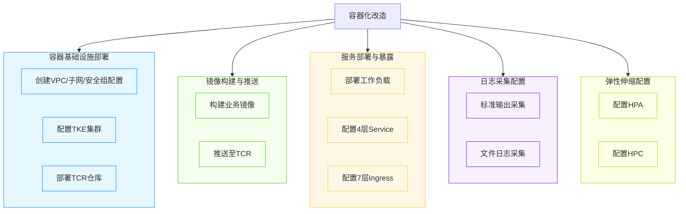

### 业务访问链路设计

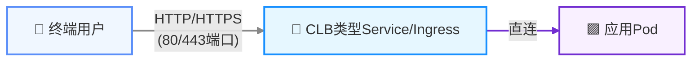
### 前提条件

1. ​**腾讯云账号**​：子账号需 `QcloudTKEAccess` 权限

  - 访问地址：[使用 TKE 预设策略授权](https://cloud.tencent.com/document/product/457/46033) 
3. ​**网络环境**​：- VPC CIDR：`172.18.0.0/16`（默认，变量可自设）。
	- 子网分配：默认南京一区（`primary`）、南京三区（`secondary`）。
4. ​**TKE 集群规格​**​：
    - TKE 集群规格 ≥ L20
5. ​**TCR 镜像仓库​**​：
	- TCR 企业版实例
	

### 快速开始

#### 步骤1：容器基础设施搭建
```
# 执行基础设施部署脚本
./deploy_infra.sh

# 输入必要参数（使用默认值可直接回车）
read -p "区域（默认ap-nanjing）: " REGION
REGION=${REGION:-"ap-nanjing"}
read -p "VPC CIDR（默认172.18.0.0/16）: " VPC_CIDR
VPC_CIDR=${VPC_CIDR:-"172.18.0.0/16"}
read -p "Kubernetes版本（默认1.32.2）: " CLUSTER_VERSION
CLUSTER_VERSION=${CLUSTER_VERSION:-"1.32.2"}
read -p "服务CIDR（默认10.200.0.0/22）: " SERVICE_CIDR
SERVICE_CIDR=${SERVICE_CIDR:-"10.200.0.0/22"}
read -p "节点实例类型（默认SA5.MEDIUM4）: " INSTANCE_TYPE
INSTANCE_TYPE=${INSTANCE_TYPE:-"SA5.MEDIUM4"}
```
- 预期输出结果​：
```
Outputs:

cluster_id = "cls-fd8ac5gw"
security_group_id = "sg-rnns31d0"
subnet_primary_id = "subnet-d0vg9406"
subnet_secondary_id = "subnet-92e7nex0"
suffix = "gp8c80r3"
tcr_registry_url = "tcr-kestrelli-gp8c80r3.tencentcloudcr.com"
vpc_id = "vpc-ksny35r1"

=== 高可用基础设施创建完成 ===
随机后缀：gp8c80r3
VPC ID: vpc-ksny35r1
安全组 ID: sg-rnns31d0
子网 ID:
  primary: subnet-d0vg9406
  secondary: subnet-92e7nex0
TCR 仓库 URL: tcr-kestrelli-gp8c80r3.tencentcloudcr.com
集群 ID: cls-fd8ac5gw
kubeconfig 文件已生成：kubeconfig.yaml
```

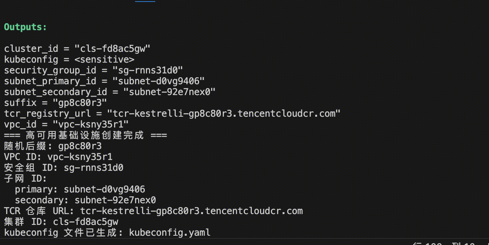

#### 步骤2：镜像构建及推送
```
# 执行部署脚本并输入必要参数
./deploy_images.sh
read -p "输入TCR仓库URL（TCR_REGISTRY_URL）: " TCR_REGISTRY_URL #步骤1生成的TCR仓库URL
read -p "输入TCR凭证服务级用户名: " TCR_USERNAME
read -s -p "输入TCR凭证服务级密码: " TCR_PASSWORD
read -p "输入TCR命名空间（默认default）: " TCR_NAMESPACE
TCR_NAMESPACE=${TCR_NAMESPACE:-"default"}  
read -p "输入镜像版本（默认v3.5.0）: " IMAGE_TAG
IMAGE_TAG=${IMAGE_TAG:-"v3.5.0"}
```
- 预期输出结果​：
```
[√] 镜像构建和推送完成!
================================
镜像地址: tcr-kestrelli-gp8c80r3.tencentcloudcr.com/default/petclinic:v3.5.0
TCR仓库URL: tcr-kestrelli-gp8c80r3.tencentcloudcr.com
TCR命名空间: default
镜像版本: v3.5.0
```

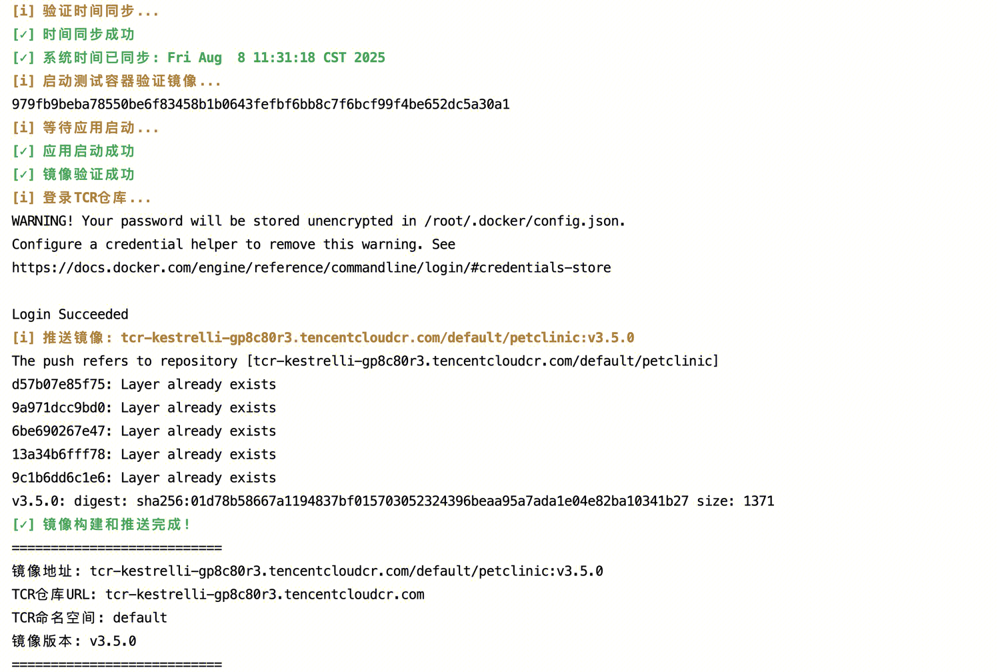

#### 步骤3：服务部署与暴露
```
# 执行服务部署脚本
./deploy_services.sh
read -p "输入TCR镜像完整地址（TCR_IMAGE_FQIN）: " TCR_IMAGE_FQIN
read -p "输入TCR凭证服务级用户名（TCR_USERNAME）: " TCR_USERNAME
read -s -p "输入TCR凭证服务级密码（TCR_PASSWORD）: " TCR_PASSWORD
read -p "输入TCR仓库URL（TCR_REGISTRY_URL）: " TCR_REGISTRY_URL
```
- 预期输出结果​：
```
[√] 服务部署与暴露配置全部完成!
================================
工作负载状态: 3个副本可用
4层服务地址: http://1.13.10.227:8080
7层服务地址: http://1.13.117.179
```
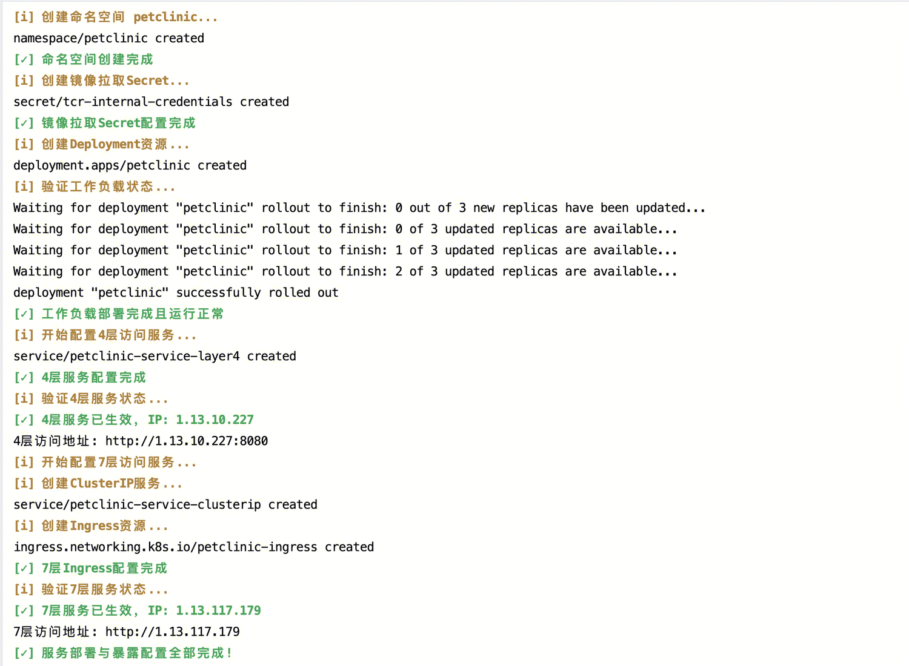
- 4层访问验证​：访问http://1.13.10.227:8080， 成功访问部署在TKE集群上的Spring PetClinic应用，浏览器完整显示应用首页
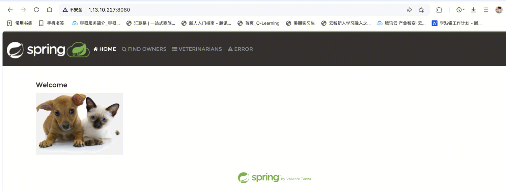
- 7层访问验证​：访问http://1.13.117.179， 成功访问部署在TKE集群上的Spring PetClinic应用，浏览器完整显示应用首页

#### 步骤4：日志采集
```
# 启动日志采集配置
./deploy_logging.sh
```
- 预期输出结果​：
```
[√] 日志采集配置全部完成!
================================
日志规则1: petclinic-log-stdout (容器标准输出)
日志规则2: petclinic-log-files (容器文件路径)
```
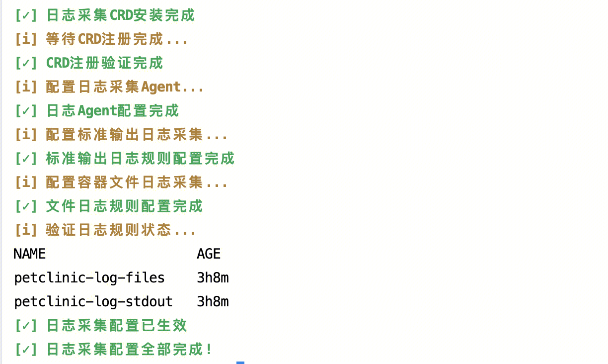
- 在腾讯云控制台中可以查看到两条日志采集规则配置：

|规则名称|类型|提取模式
|:-:|:-:|:-:|:-:|
|`petclinic-log-stdout`|容器标准输出|单行文本|
|`petclinic-log-files`|容器文件路径|单行-完全正则
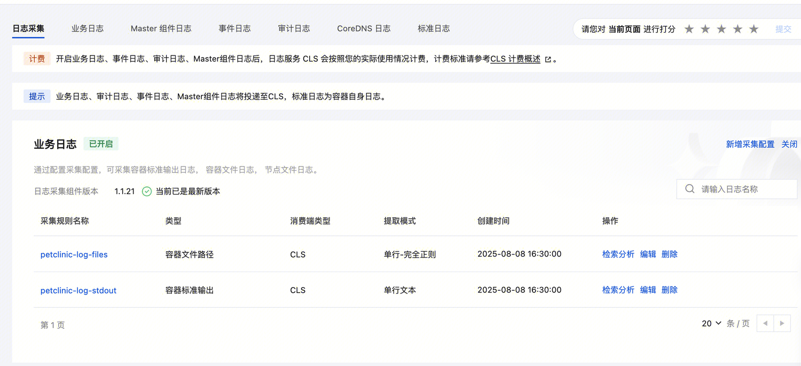
#### 步骤5：弹性伸缩配置
```
# 启动弹性伸缩配置
./deploy_autoscale.sh
```
- 预期输出结果​：
```
[√] 弹性伸缩配置全部完成!
================================
HPA策略：petclinic-hpa (最小3副本，最大20副本)
HPC策略：petclinic-hpc (3条定时策略)
```
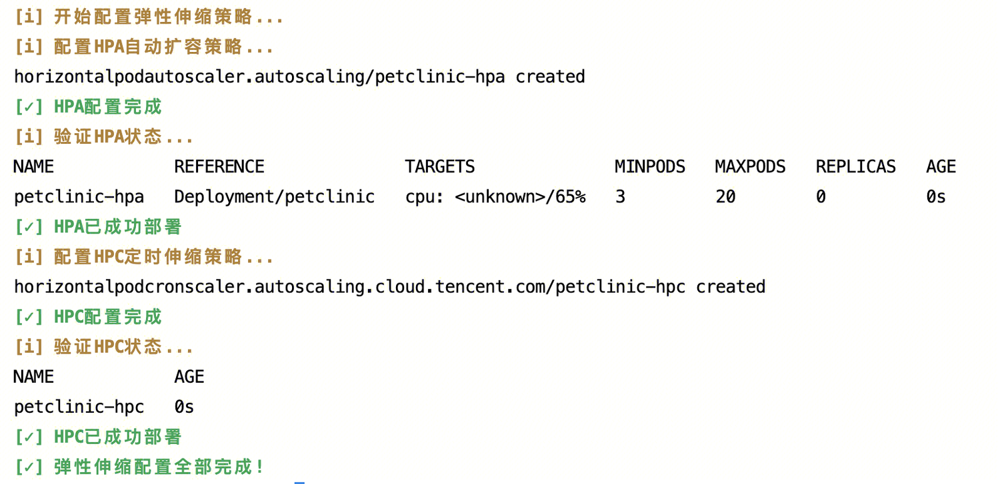
- HPA 配置状态（在腾讯云控制台可查看验证效果）
  - 触发条件​：CPU利用率达到65%后自动扩缩容
  - 副本范围​：始终保持在3-20个副本之间
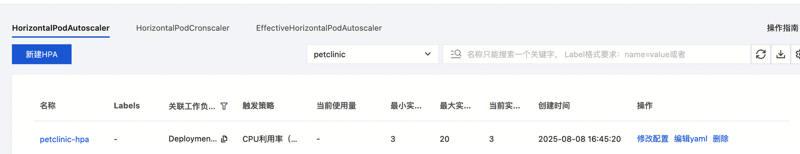
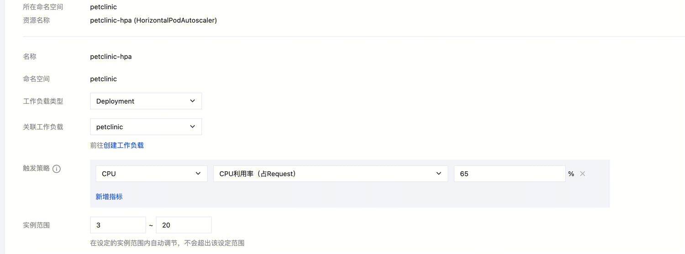
- HPC 定时策略（在腾讯云控制台可查看验证效果）
  - 工作日策略​：早8点扩容至10副本，晚18点缩容至3副本
  - 周末策略​：周五23:30缩容至2副本
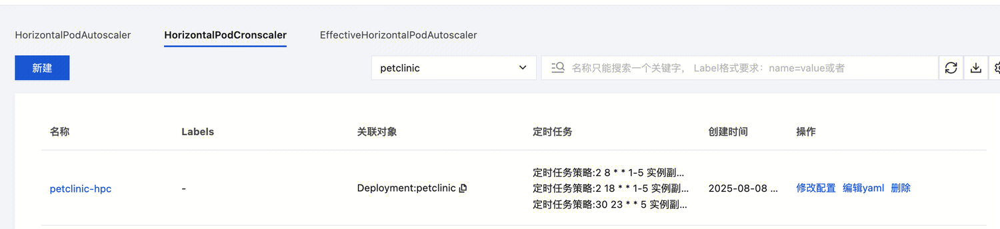
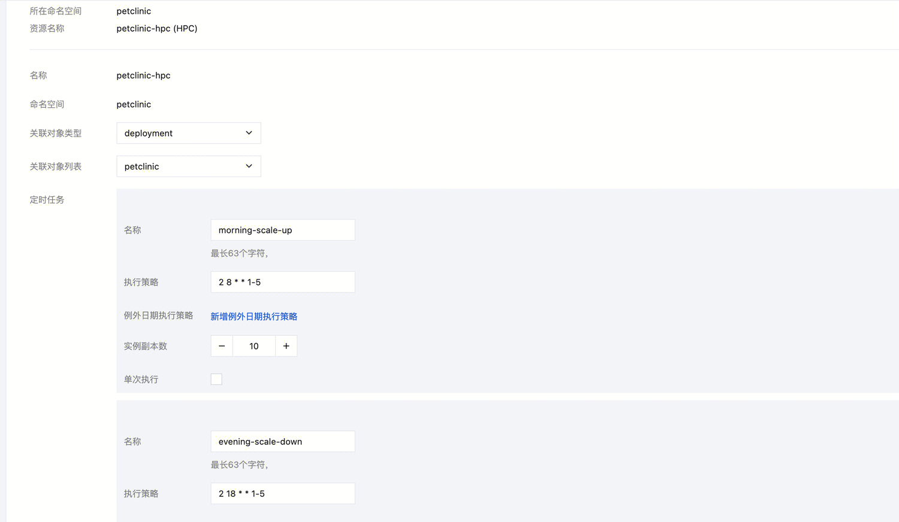


### 演练环境配置举例说明

#### 配置1：多子网高可用设计（默认南京一区/三区）
**网络配置​**:
```
variable "subnets" {
  description = "子网配置"
  type = map(object({
    cidr = string
    az   = string
  }))
  default = {
    "primary" = {
      cidr = "172.18.100.0/24"
      az   = "ap-nanjing-1"
    }
    "secondary" = {
      cidr = "172.18.101.0/24"
      az   = "ap-nanjing-3"
    }
  }
}
```

#### 配置2：TKE集群与节点池配置

##### ​**原生节点池​**:
```
### ===== 南京一区专用节点池（primary子网） =====
  native {
    instance_charge_type = "POSTPAID_BY_HOUR"
    instance_types       = [var.instance_type]
    security_group_ids   = [tencentcloud_security_group.main.id]
    subnet_ids           = [tencentcloud_subnet.subnets["primary"].id] # 仅使用primary子网
    
    key_ids              = ["skey-gigpdrzz"]
    replicas             = 2  # 可用区1节点数
    machine_type         = "Native"
    
    scaling {
      min_replicas  = 2
      max_replicas  = 6
      create_policy = "ZoneEquality"  # 确保节点均匀分布
    }
    
    system_disk {
      disk_type = "CLOUD_BSSD"
      disk_size = 100
    }

    data_disks {
      auto_format_and_mount = true
      disk_type             = "CLOUD_BSSD"
      disk_size             = 100
      file_system           = "ext4"
      mount_target          = "/var/lib/container"
    }
  }

### ===== 南京三区专用节点池（primary子网） =====
  native {
    instance_charge_type = "POSTPAID_BY_HOUR"
    instance_types       = [var.instance_type]
    security_group_ids   = [tencentcloud_security_group.main.id]
    subnet_ids           = [tencentcloud_subnet.subnets["secondary"].id] # 仅使用secondary子网
    
    key_ids              = ["skey-gigpdrzz"]
    replicas             = 2  # 可用区3节点数
    machine_type         = "Native"
    
    scaling {
      min_replicas  = 2
      max_replicas  = 6
      create_policy = "ZoneEquality"  # 确保节点均匀分布
    }
    
    system_disk {
      disk_type = "CLOUD_BSSD"
      disk_size = 100
    }

    data_disks {
      auto_format_and_mount = true
      disk_type             = "CLOUD_BSSD"
      disk_size             = 100
      file_system           = "ext4"
      mount_target          = "/var/lib/container"
    }
  }
  ```
  
#####  **超级节点池​**:
  ```
  # 主可用区节点
  serverless_nodes {
    display_name = "super-node-1"
    subnet_id    = tencentcloud_subnet.subnets["primary"].id
  }
  # 备用可用区节点
  serverless_nodes {
    display_name = "super-node-2"
    subnet_id    = tencentcloud_subnet.subnets["secondary"].id
  }
  
  labels = {
    "workload-type" = "elastic"
    "ha"            = "enabled"
  }
  
  lifecycle {
    ignore_changes = [
      serverless_nodes
    ]
  }
  ```
  
#### 配置3：四层/七层访问入口

##### ​**四层访问​**:
```
apiVersion: v1
kind: Service
metadata:
  name: petclinic-service-layer4
  namespace: $K8S_NAMESPACE
  annotations:
    service.cloud.tencent.com/direct-access: "true"
spec:
  type: LoadBalancer
  externalTrafficPolicy: Local
  selector:
    app: petclinic
  ports:
  - protocol: TCP
    port: 8080
    targetPort: 8080
```
##### **七层访问​**:
```
apiVersion: v1
kind: Service
metadata:
  name: petclinic-service-clusterip
  namespace: $K8S_NAMESPACE
spec:
  type: ClusterIP
  selector:
    app: petclinic
  ports:
  - name: http
    protocol: TCP
    port: 80
    targetPort: 8080

apiVersion: networking.k8s.io/v1
kind: Ingress
metadata:
  name: petclinic-ingress
  namespace: $K8S_NAMESPACE
  annotations:
    ingress.cloud.tencent.com/direct-access: "true"
spec:
  ingressClassName: qcloud
  rules:
  - http:
      paths:
      - path: /
        pathType: Prefix
        backend:
          service:
            name: petclinic-service-clusterip
            port:
              number: 80
```

#### 配置4：日志采集

##### **标准输出日志采集​**:
```
### ===== 配置标准输出日志采集 =====
apiVersion: cls.cloud.tencent.com/v1
kind: LogConfig
metadata:
  name: petclinic-log-stdout
spec:
  inputDetail:
    type: container_stdout
    containerStdout:
      namespace: ${K8S_NAMESPACE}
      workload:
        - kind: Deployment
          name: petclinic
          namespace: ${K8S_NAMESPACE}
  clsDetail:
    logsetName: "TC-log"  # 指定日志集名称（自动创建）
    topicName: "petclinic-stdout-topic"  # 指定日志主题名称（自动创建）
    logType: minimalist_log
```
##### **容器文件日志采集​**:
```
### ===== 配置容器文件日志采集 =====
apiVersion: cls.cloud.tencent.com/v1
kind: LogConfig
metadata:
  name: petclinic-log-files
spec:
  inputDetail:
    type: container_file
    containerFile:
      namespace: ${K8S_NAMESPACE}
      container: '*'  # 采集所有容器
      logPath: /var/log  # 官方文档中常用路径
      filePattern: '*.log'  # 日志文件模式
      workload:
        - kind: Deployment
          name: petclinic
          namespace: ${K8S_NAMESPACE}
  clsDetail:
    logsetName: "TC-log"  # 使用同一个日志集
    topicName: "petclinic-file-topic"  # 不同的主题
    logType: fullregex_log  # 完全正则格式
```

#### 配置5：弹性伸缩

##### **HPA 配置​**:
```
### ===== 配置HPA水平伸缩 =====
apiVersion: autoscaling/v2
kind: HorizontalPodAutoscaler
metadata:
  name: petclinic-hpa
  namespace: $K8S_NAMESPACE
spec:
  behavior:  # 添加平滑扩缩策略
    scaleDown:
      stabilizationWindowSeconds: 300  # 5分钟冷却期
      policies:
      - type: Percent
        value: 10
        periodSeconds: 60
    scaleUp:
      stabilizationWindowSeconds: 60    # 1分钟快速扩容
      policies:
      - type: Percent
        value: 100
        periodSeconds: 60
  scaleTargetRef:
    apiVersion: apps/v1
    kind: Deployment
    name: petclinic
  minReplicas: 3
  maxReplicas: 20
  metrics:
  - type: Resource
    resource:
      name: cpu
      target:
        type: Utilization
        averageUtilization: 65
```
##### **HPC 配置​**:
```
### ===== 配置HPC定时伸缩策略 =====
apiVersion: autoscaling.cloud.tencent.com/v1
kind: HorizontalPodCronscaler 
metadata:
  name: petclinic-hpc
  namespace: $K8S_NAMESPACE
spec:
  scaleTarget:
    apiVersion: apps/v1
    kind: Deployment
    name: petclinic
    namespace: $K8S_NAMESPACE
  crons:
  - name: morning-scale-up
    schedule: "2 8 * * 1-5"    # 添加分钟偏移，避免整点高峰冲突
    targetSize: 10
  - name: evening-scale-down
    schedule: "2 18 * * 1-5"   # 添加分钟偏移
    targetSize: 3
  - name: weekend-scale-down
    schedule: "30 23 * * 5"    # 调整为周五晚上11:30，避免周六凌晨处理
    targetSize: 2
```


### 项目结构
```
containerization-transformation/
├── infra/                  # Terraform基础设施
│   ├── deploy_infra.sh     # 主脚本（创建VPC/TKE/TCR/验证）
│   ├── terraform/          # Terraform 模块
        └── network.tf          # 网络模块资源
        └── cluster.tf          # 集群模块资源
        └── tcr.tf              # 镜像模块资源
        └── providers.tf        # 腾讯云提供者
	└── variables.tf        # 定义变量传递
│       └── output.tf           # 资源输出定义
├── images/                 # 镜像构建及推送
│   ├── deploy_images.sh    # 主脚本（镜像构建/推送）
│   ├── Dockerfile              # 应用容器化定义
├── services/               # 服务与暴露
│   ├── deploy_services.sh  # 主脚本（服务/暴露/验证）
│   └── k8s-manifests/          #K8s YAML 文件
├── logging/                # 日志采集
│   ├── deploy_logging.sh   # 主脚本（标准输出日志/容器文件日志）
│   └── k8s-manifests/          #K8s YAML 文件
├── autoscale/              # 弹性伸缩
│   ├── deploy_autoscale.sh # 主脚本（HPA/HPC）
│   └── k8s-manifests/          # K8s YAML 文件
├── docs/                   # 文档
│   └── README.md           # 本指南
```
