[English](README.md) | [中文](README_zh.md)

###  **Background & Necessity**

Traditional application deployments face challenges like low resource utilization, slow scaling, and complex maintenance. Containerization through Kubernetes standardization enables:
- **Resource Elasticity**: On-demand scaling to reduce idle costs
- ​**High Availability**: Multi-AZ deployment to eliminate single points of failure

### **Practical Significance**
This project delivers a complete containerization workflow for business systems, demonstrating TKE's core capabilities with native nodes and super nodes. It provides reusable technical experience and best practices, offering robust product support and implementation references for customer business expansion.

###  **Core Value**

1. **Cost Optimization**: Native nodes (persistent) + Super nodes (elastic)
2. ​**HA Architecture**: Dual-AZ deployment in Nanjing Zone 1 + Nanjing Zone 3
3. ​**One-Click Ops**: Log collection + Auto-scaling + Scheduled scaling
4. ​**Security Compliance**: Private TCR registry + Internal access + Granular permissions


###  📊 Deployment Architecture


###  📡 Business Access Flow

```mermaid
graph LR
    User["👥 End Users"] --> |"HTTP/HTTPS<br>(Ports 80/443)"| LB["🔵 CLB Service/Ingress"]
    LB --> |"Direct Access"| Pod["🟪 Application Pods"]
    
    classDef user fill:#f0f7ff,stroke:#5b8ff9,stroke-width:2px;
    classDef lb fill:#e6f7ff,stroke:#1890ff,stroke-width:2px;
    classDef pod fill:#f9f0ff,stroke:#722ed1,stroke-width:2px;
    
    class User user
    class LB lb
    class Pod pod
```


###  🛠 Prerequisites

**1.Tencent Cloud Account**: Sub-account requires `QcloudTKEAccess` permission
- Access：[Authorization with TKE Preset Policies](https://cloud.tencent.com/document/product/457/46033) 

**2.Network Environment**:
- VPC CIDR: `172.18.0.0/16` (default, customizable)
- Subnets: Nanjing Zone 1 (`primary`), Nanjing Zone 3 (`secondary`)

**3. TKE Cluster Specs**:
- TKE cluster specification ≥ L20

**4.TCR Registry**:
- TCR 企业版实例
	

###  🚀 Quick Start

####  Step 1: Infrastructure Setup
```
# Execute infrastructure deployment script
./infra/deploy_infra.sh
```
- **Expected Output**:

```
Outputs:
cluster_id = "cls-fd8ac5gw"
security_group_id = "sg-rnns31d0"
subnet_primary_id = "subnet-d0vg9406"
subnet_secondary_id = "subnet-92e7nex0"
suffix = "gp8c80r3"
tcr_registry_url = "tcr-kestrelli-gp8c80r3.tencentcloudcr.com"
vpc_id = "vpc-ksny35r1"

=== HA Infrastructure Created ===
Random suffix: gp8c80r3
VPC ID: vpc-ksny35r1
Security Group ID: sg-rnns31d0
Subnet IDs:
  primary: subnet-d0vg9406
  secondary: subnet-92e7nex0
TCR URL: tcr-kestrelli-gp8c80r3.tencentcloudcr.com
Cluster ID: cls-fd8ac5gw
kubeconfig generated: kubeconfig.yaml
```


####  Step 2: Image Build & Push
```
# Execute image deployment script
./images/deploy_images.sh
```
- **Expected Output**:

```
[√] Image build & push complete!
================================
Image: tcr-kestrelli-gp8c80r3.tencentcloudcr.com/default/petclinic:v3.5.0
TCR URL: tcr-kestrelli-gp8c80r3.tencentcloudcr.com
TCR Namespace: default
Image Version: v3.5.0
```


####  Step 3: Service Deployment
```
# Execute service deployment script
./services/deploy_services.sh
```
- **Expected Output**:

```
[√] Service deployment complete!
================================
Workload Status: 3 replicas available
Layer-4 Access: http://1.13.10.227:8080
Layer-7 Access: http://1.13.117.179
```


**Access Verification**:
-  Layer-4: http://1.13.10.227:8080 (Spring PetClinic homepage)


- Layer-7: http://1.13.117.179 (Spring PetClinic homepage)


#### Step 4: Log Collection

```
# Configure log collection
./logging/deploy_logging.sh
```
- **Expected Output**:

```
[√] Log collection configured!
================================
Rule 1: petclinic-log-stdout (Container stdout)
Rule 2: petclinic-log-files (Container file paths)
```


- **Console Verification**:

|RuleName|Type|ExtractionMode|
|:-:|:-:|:-:|
|`petclinic-log-stdout`|Container stdout|Single-line text|
|`petclinic-log-files`|Container files|Regex parsing|


#### Step 5: Auto-Scaling Configuration

```
# Configure auto-scaling
./autoscale/deploy_autoscale.sh
```

- **Expected Output**:

```
[√] Auto-scaling configured!
================================
HPA: petclinic-hpa (min 3, max 20 replicas)
HPC: petclinic-hpc (3 scheduled policies)
```


**Console Verification**:

- HPA Configuration: Scales at 65% CPU (3-20 replicas)


- HPC Scheduled Scaling:
	- Weekdays: Scale to 10 replicas at 8 AM, down to 3 at 6 PM
	- Weekends: Scale to 2 replicas Friday at 11:30 PM


###  ⚙️ Configuration Examples

####  1. Multi-Subnet HA Design (Nanjing Zones 1 & 3)
```
variable "subnets" {
  default = {
    "primary" = {
      cidr = "172.18.100.0/24"
      az   = "ap-nanjing-1"
    }
    "secondary" = {
      cidr = "172.18.101.0/24"
      az   = "ap-nanjing-3"
    }
  }
}
```

####  2. TKE Cluster & Node Pools

##### **Native Node Pool**:
```
  native {
    instance_charge_type = "POSTPAID_BY_HOUR"
    instance_types       = [var.instance_type]
    security_group_ids   = [tencentcloud_security_group.main.id]
    subnet_ids           = [tencentcloud_subnet.subnets["primary"].id] 
    
    key_ids              = ["skey-gigpdrzz"]
    replicas             = 2  
    machine_type         = "Native"
    
    scaling {
      min_replicas  = 2
      max_replicas  = 6
      create_policy = "ZoneEquality"  
    }
    
    system_disk {
      disk_type = "CLOUD_BSSD"
      disk_size = 100
    }

    data_disks {
      auto_format_and_mount = true
      disk_type             = "CLOUD_BSSD"
      disk_size             = 100
      file_system           = "ext4"
      mount_target          = "/var/lib/container"
    }
  }

  native {
    instance_charge_type = "POSTPAID_BY_HOUR"
    instance_types       = [var.instance_type]
    security_group_ids   = [tencentcloud_security_group.main.id]
    subnet_ids           = [tencentcloud_subnet.subnets["secondary"].id] 
    
    key_ids              = ["skey-gigpdrzz"]
    replicas             = 2 
    machine_type         = "Native"
    
    scaling {
      min_replicas  = 2
      max_replicas  = 6
      create_policy = "ZoneEquality"  
    }
    
    system_disk {
      disk_type = "CLOUD_BSSD"
      disk_size = 100
    }

    data_disks {
      auto_format_and_mount = true
      disk_type             = "CLOUD_BSSD"
      disk_size             = 100
      file_system           = "ext4"
      mount_target          = "/var/lib/container"
    }
  }
  ```
  
#####  **Super Node Pool**:
  ```
  serverless_nodes {
    display_name = "super-node-1"
    subnet_id    = tencentcloud_subnet.subnets["primary"].id
  }
  serverless_nodes {
    display_name = "super-node-2"
    subnet_id    = tencentcloud_subnet.subnets["secondary"].id
  }
  
  labels = {
    "workload-type" = "elastic"
    "ha"            = "enabled"
  }
  
  lifecycle {
    ignore_changes = [
      serverless_nodes
    ]
  }
  ```
  
####  3. Layer-4/7 Access

#####**Layer-4 Service**:
```
apiVersion: v1
kind: Service
metadata:
  name: petclinic-service-layer4
  namespace: $K8S_NAMESPACE
  annotations:
    service.cloud.tencent.com/direct-access: "true"
spec:
  type: LoadBalancer
  externalTrafficPolicy: Local
  selector:
    app: petclinic
  ports:
  - protocol: TCP
    port: 8080
    targetPort: 8080
```
##### **Layer-7 Ingress**:
```
apiVersion: v1
kind: Service
metadata:
  name: petclinic-service-clusterip
  namespace: $K8S_NAMESPACE
spec:
  type: ClusterIP
  selector:
    app: petclinic
  ports:
  - name: http
    protocol: TCP
    port: 80
    targetPort: 8080

apiVersion: networking.k8s.io/v1
kind: Ingress
metadata:
  name: petclinic-ingress
  namespace: $K8S_NAMESPACE
  annotations:
    ingress.cloud.tencent.com/direct-access: "true"
spec:
  ingressClassName: qcloud
  rules:
  - http:
      paths:
      - path: /
        pathType: Prefix
        backend:
          service:
            name: petclinic-service-clusterip
            port:
              number: 80
```

#### 4. Log Collection

##### **Stdout Logs**:
```
apiVersion: cls.cloud.tencent.com/v1
kind: LogConfig
metadata:
  name: petclinic-log-stdout
spec:
  inputDetail:
    type: container_stdout
    containerStdout:
      namespace: ${K8S_NAMESPACE}
      workload:
        - kind: Deployment
          name: petclinic
          namespace: ${K8S_NAMESPACE}
  clsDetail:
    logsetName: "TC-log"  
    topicName: "petclinic-stdout-topic"  
    logType: minimalist_log
```
##### **File Logs**:
```
apiVersion: cls.cloud.tencent.com/v1
kind: LogConfig
metadata:
  name: petclinic-log-files
spec:
  inputDetail:
    type: container_file
    containerFile:
      namespace: ${K8S_NAMESPACE}
      container: '*' 
      logPath: /var/log  
      filePattern: '*.log'  
      workload:
        - kind: Deployment
          name: petclinic
          namespace: ${K8S_NAMESPACE}
  clsDetail:
    logsetName: "TC-log"  
    topicName: "petclinic-file-topic"  
    logType: fullregex_log  
```

#### 5. Auto-Scaling

##### **HPA Configuration**:
```
apiVersion: autoscaling/v2
kind: HorizontalPodAutoscaler
metadata:
  name: petclinic-hpa
  namespace: $K8S_NAMESPACE
spec:
  behavior:  
    scaleDown:
      stabilizationWindowSeconds: 300  
      policies:
      - type: Percent
        value: 10
        periodSeconds: 60
    scaleUp:
      stabilizationWindowSeconds: 60    
      policies:
      - type: Percent
        value: 100
        periodSeconds: 60
  scaleTargetRef:
    apiVersion: apps/v1
    kind: Deployment
    name: petclinic
  minReplicas: 3
  maxReplicas: 20
  metrics:
  - type: Resource
    resource:
      name: cpu
      target:
        type: Utilization
        averageUtilization: 65
```
##### **HPC Scheduled Scaling**:
```
apiVersion: autoscaling.cloud.tencent.com/v1
kind: HorizontalPodCronscaler 
metadata:
  name: petclinic-hpc
  namespace: $K8S_NAMESPACE
spec:
  scaleTarget:
    apiVersion: apps/v1
    kind: Deployment
    name: petclinic
    namespace: $K8S_NAMESPACE
  crons:
  - name: morning-scale-up
    schedule: "2 8 * * 1-5"    
    targetSize: 10
  - name: evening-scale-down
    schedule: "2 18 * * 1-5"   
    targetSize: 3
  - name: weekend-scale-down
    schedule: "30 23 * * 5"    
    targetSize: 2
```


### 📂 Project Structure
```
containerization-transformation/  
├── infra/                  # Terraform infrastructure  
│   ├── deploy_infra.sh     # Main script  
│   └── terraform/          # Terraform modules 
│       ├── network.tf  
│       ├── cluster.tf  
│       ├── tcr.tf  
│       ├── providers.tf  
│       ├── variables.tf  
│       └── output.tf  
├── images/                 # Image build & push 
│   ├── deploy_images.sh    # Main script (image build/push)  
│   ├── Dockerfile          # Application 
│   └── settings.xml        # Maven mirror 
├── services/               # Service deployment 
│   ├── deploy_services.sh  # Main script  
│   └── manifests/          # Kubernetes YAML 
│       ├── namespace.yaml  
│       ├── deployment.yaml  
│       ├── service-clusterip.yaml  
│       ├── service-layer4.yaml  
│       └── ingress.yaml  
├── logging/                # Log collection  
│   ├── deploy_logging.sh   # Main script 
│   └── manifests/          # Kubernetes YAML 
│       ├── logconfig-crd.yaml  
│       ├── logconfig-stdout.yaml  
│       └── logconfig-files.yaml  
├── autoscale/              # Auto-scaling  
│   ├── deploy_autoscale.sh # Main script 
│   └── manifests/          # Kubernetes YAML   
│       ├── hpa.yaml  
│       └── hpc.yaml  
└── docs/                   # Documentation  
    └── README.md           # This guide  
```
